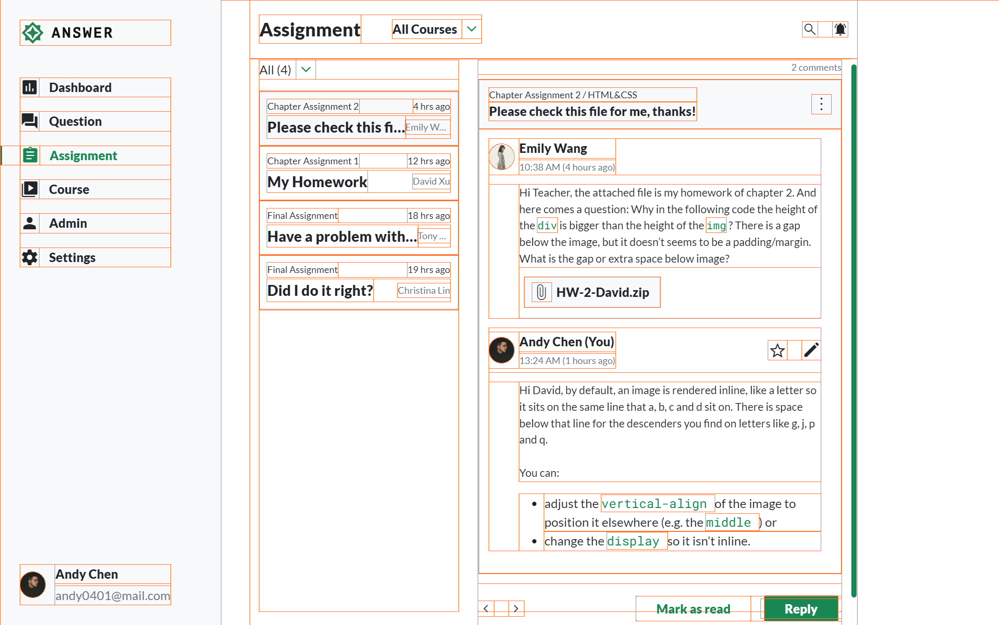

# layouting-2023-main-w5

- 主線任務-W5

> <https://rpg.hexschool.com/task/350/show>

- 設計稿

> <https://xd.adobe.com/view/456141fc-d0a0-44d4-93ad-6ab54a4b5351-1032/grid>

- 圖片倉庫

> <https://github.com/hexschool/2022-web-layout-training/tree/main/week5>

---

## LV.1

```markdown
LV1：做 1 頁版型
```

### NOTES

- 嘗試以 `Normalize.css` 作為 `reset`

#### modal

- 用 `input`、`label` 來製作星星符號、`modal`

> <https://codepen.io/NoNameNote/pen/OJaqdJK>

#### 彈出效果

> 縮回效果好像無法只用 `CSS`，可能要搭配 `JS`（？）

```CSS
.modal {
  animation: show 0.3s linear;
}

@keyframes show {
  from {
    opacity: 0;
    transform: scale(0);
  }

  to {
    opacity: 1;
    transform: scale(1);
  }
}
```

#### 裁切多餘文字

- 自動用 `...` 取代呈現

```CSS
  overflow: hidden;
  white-space: nowrap;
  text-overflow: ellipsis;
```

### SCSS

```markdown
+---base
|       _base.scss      <!-- global tag -->
|       _font.scss
|       _reset.scss     <!-- Normalize.css -->
|       
+---components
|       _button.scss
|       _scrollbar.scss
|       
+---layout
|       _footer.scss
|       _header.scss
|       _navbar.scss
|       
+---pages
|       _index.scss
|       
+---themes
|       _theme.scss   <!-- color -->
|       
\---utils
        _functions.scss   <!-- margin, padding, gap -->
        _helpers.scss     <!-- container -->
        _utilities.scss   <!-- general class: display, position... -->
        _variables.scss
```

### Screenshots




---

## 原版指令說明

### Node.js 版本

- 專案的 Node.js 版本需為 v16 以上
- 查看自己版本指令：`node -v`

---

### 指令列表

- `npm install` - 初次下載該範例專案後，需要使用 npm install 來安裝套件
- `npm run dev` - 執行開發模式
  - 若沒有自動開啟瀏覽器，可嘗試手動在瀏覽器上輸入
    `http://localhost:5173/<專案名稱>/pages/index.html`
- `npm run build` - 執行編譯模式（不會開啟瀏覽器）
- `npm run deploy` - 自動化部署

---

### 資料夾結構

- assets # 靜態資源放置處
  - images # 圖片放置處
  - scss # SCSS 的樣式放置處
    - layout # ejs 模板放置處
    - pages # 頁面放置處

- JavaScript 程式碼可寫在 main.js 檔案

#### 注意事項

- 已將 pages 資料夾內的 index.html 預設為首頁，建議不要任意修改 index.html 的檔案名稱

- .gitignore 檔案是用來忽略掉不該上傳到 GitHub 的檔案（例如 node_modules），請不要移除 .gitignore

### 開發模式的監聽

vite 專案執行開發模式 `npm run dev` 後即會自動監聽，不需要使用 `Live Sass Compiler` 的 `Watch SCSS` 功能

---

### 部署 gh-pages 流程說明

#### Windows 版本

1. 在 GitHub 建立一個新的 Repository

2. 部署前請務必先將原始碼上傳到 GitHub Repository 也就是初始化 GitHub，因此通常第一步驟會在專案終端機輸入以下指令

```cmd
git init # 若已經初始化過就可以不用輸入
git add .
git commit -m 'first commit'
git branch -M main
git remote add origin [GitHub Repositories Url]
git push -u origin main // 僅限第一次輸入，往後只需要輸入 git push
```

```markdown
3. 初始化完畢後，執行 `npm run deploy` 指令進行自動化部署
```
